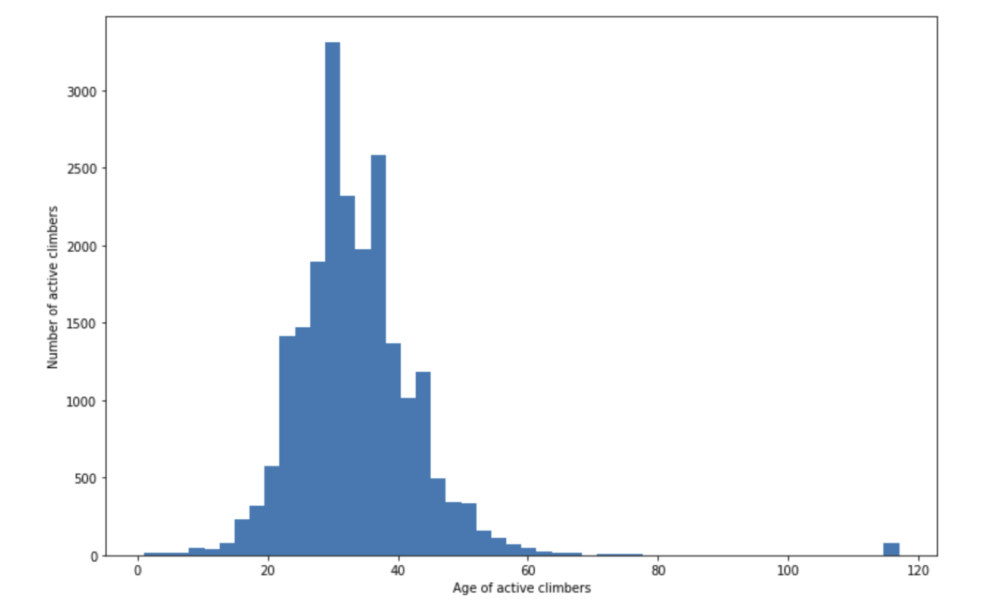
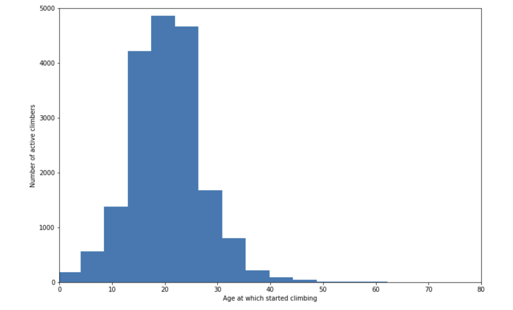

# Analyzing data from 8a.nu Climbing logbook

We have been analysing the 8a.nu Climbing logbook, using the data scrapped by David Cohen, available on Kaggle at https://www.kaggle.com/dcohen21/8anu-climbing-logbook. 

After cleaning the data and getting rid of some non-sensical datapoints (e.g there are 67 climbers who started climbing before they were born) we reduced the list of users to 36031 active climbers, i.e climbers with recorded ascends. 

## Age of climbers

The bulk of climbers are between 20 and 40 years old, with and average age of 33. 

Most of them started climbing between 10 and 30 years old, with an average starting age of 20

## Height vs maximum performance

A hotly debated subject is the role of height in climbing performance. We ploted the height of climbers
against their highest achieved grade.

First we notice that indeed male tend to climb slighlty harder than female, although note that there are 
only 6112 active female climbers, so probably not enough do draw a conclusion. 

The bulk of (male) climbers seem to be between 150 and 200 cm, and the ideal height seems to be around 180 cm.   
For female, height does not seem to affect max performance that much.
