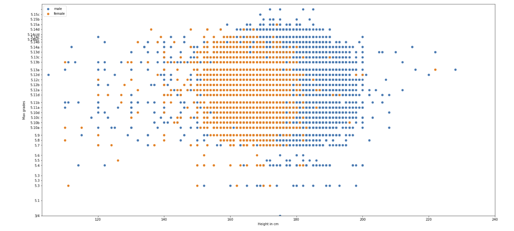

# Analyzing data from 8a.nu Climbing logbook

We have been analysing the 8a.nu Climbing logbook, using the data scrapped by David Cohen, available on Kaggle at https://www.kaggle.com/dcohen21/8anu-climbing-logbook. 

After cleaning the data and getting rid of some non-sensical datapoints (e.g there are 67 climbers who started climbing before they were born) we reduced the list of users to 36031 active climbers, i.e climbers with recorded ascends. 

## Age of climbers

The bulk of climbers are between 20 and 40 years old, with and average age of 33. 

Most of them started climbing between 10 and 30 years old, with an average starting age of 20

## Height vs maximum performance

A hotly debated subject is the role of height in climbing performance. We ploted the height of climbers
against their highest achieved grade.

First we notice that indeed male tend to climb slighlty harder than female, although note that there are 
only 6112 active female climbers, so probably not enough do draw a conclusion. 

The bulk of (male) climbers seem to be between 150 and 200 cm, and the ideal height seems to be around 180 cm.   
For female, height does not seem to affect max performance that much.

## Averager number of years to achieve a given grade

We looked at the average number of years it takes to achieve a given grade. The database is 
consists of sport climb and boulder ascents, so we looked at both discipline separately. 

We see that there is a lot of noise, but overall, the higher the grades, the many more years of practice it takes. 

## Probability of achieving a given graded conditioned on having achieved the previous one

Next we looked at a potential measure of how hard it is to improve as ones level improves. We plotted the probability 
a climber has to climb a given grade, conditionned on him having climbed the previous grade. One would expect this conditioned probability to get lower the higher the grades.

First, the unconditioned probability to climb any given grade:

Then the conditioned probability: 

Again a lot of noise (climbers may not be precise/truthful when reporting their ascends) but indeed the 
conditioned probability seems to be higher than the unconditioned one. 
